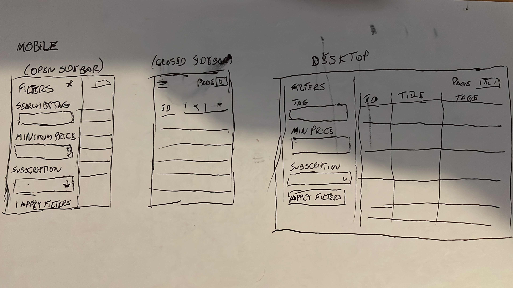

SOLUTION
========

Estimation

----------
Estimated: 6-7 hours

Spent: 8 hours

# Solution

----------

## Story analysis

Approaching any task I first analyse the requirements and deliverables.

From the product requirements and repository, we know that we'll need to build an app starting from a boilerplate of create-react-app.
The app would need to have:

1. A Sidebar with inputs representing filters, where the user can filter by: tag, price and subscription type
2. A table showing the products. It should show, at least: the title, tags, price and subscription type of each product. I don't see a hard requirement on how I should show to the user the items so I could potencially add more data to the table such as images, url to the product page.
3. The user should be able to see pagination on the table. By default the table shows 12 items but the user can change the number of items shown in the table.

----------

## Considerations before implementing

1. The boilerplate provided already has a simple way to create a mock RESTful API server using the `data/products.json` file. The `API_DOCS.md` describes usage and it works has intended when trying out some of the requests I would be doing. I would have to start the server in a diferent terminal with the script `npm run start:server`.
2. I thought about how I would approach a mobile first design of the frontend. Quickly drew up a wireframe to serve as guide (sorry about my drawing skills!!) 
3. I included a button on the sidebar. For the filters to be applied in the table the user MUST click on the `Apply filters`. This is not in the requirements, but I thought that I should include it because if the app makes a request everytime the user changes a letter on input, in the real world that would consume a lot resources increasing the load of the servier with unnecessary requests. That is a choice that I would discuss with product, exposing the pros and cons of the approach.
4. There is a field in the `products.json` that left me wondering if I should show the item or not. The item `id 12` is the only one with the field `published` set as false. There is no description if it means the item is not on storage, or some other reason. In a real work environment, I would ask the team about this item to understand if the requirements are correct. The requirements do say that the user would see 12 items in the table so I am ignoring the field.

### App structure

Considering the app scope and requirement, I decided for a simple approach, putting all my react components in a single folder. For scalability purposes in a medium size, large scale project I would consider a different approach. A components folder that would contain all of those that are reusable throughout different features or pages. A features folder where specific modules/components are built to be used on that feature scope. We could even consider a higher level of spliting components as types of pages, lines of business, etc.

### Technologies - My choices

For external libraries or dependencies I decided:

1. axios package for data fetching (I could have used fetch to lower the bundle size)
2. tailwind for styling - I decided to use tailwind because I think the utilities workflow fitter the challenge and also I wanted to learn to use it as it not something I worked with in projects.
3. state management. I decided to keep using react. Considering redux, mobx or any other 3rd party state management lib could be overkill, increase code complexity unecessarily and bundle size.

----------

## Implementation details 

1. App component is the app entry point. It makes the request `http://localhost:3010/products?_page=1&_limit=12` to the server as soon as the user lands in the page to get the 12 products. Renders the Sidebar, Table, Table Pagination and Product per page Selector. The component naming are self explanatory in the components folder.
2. I implemented a custom hook to encapsulate the data fetching logic, internal state and make the App component code cleaner separating concerns.
3. I tried to use good semantic elements and acessibility rules as I could throughout the whole code. It's not within the requirements I am aware but it seems a good rule to follow for demonstration purposes.
4. I used tailwind with a mobile first approach.

----------

## HOW TO RUN THE APP

Open 2 terminals

`npm run start:server` - runs the json-server on port 3010
`npm run start:app` or `npm start` - runs the client side app on port 3000. It opens a new tab on your browser automatically

### Interacting with the app

1. To change filters simply change the inputs. Example search for tag `Cat` and click `Apply Filters` (or press enter) so a new request can be made to the server.
2. Change the Products per page drop down to `3`. Observe the pagination buttons underneath the table.

----------

## Test Cases

I would implement these tests with cypress for testing exactly the steps the user would have to do, simulating the real user experience.

1. Test case 1 - Visit Product collection page without any filter activated. The user should see 12 items in the page, empty inputs in the sidebar and 12 in the number of items per page. Under the table there should exist only one button with page number 1
2. Test case 2 - Filter by tag - User should be able to type `Dog` in the input, click on apply filters button and see 11 products in the table with the tag `Dog`.
3. Test case 3 - Filter by price - User should be able to type 30 in the price input, click on apply filters button and see 1 product in the table.
4. Test case 4 - Filter by Subscription - User should be able change the dropdown to `yes`, click on apply filters button and observe 7 items in the table
5. Test case 5 - Filter by Subscription and Tag - User should be able change the dropdown to `yes` and search for the tag `Cat`, click on apply filters button and observe 5 items in the table
6. test case 6 - Products per page - User should be able to change the dropdown to 3 and observe 4 pages of table. Everytime we change page a new request to the server is done to provide data for that page.
7. test case 7 - Click on product opens it's product page - User should be able to click in any place of the table row representing a product to open a new tab in the browser to look at the product page

### Edge cases

8. test case 8 - Clear the price filter - The user should be able to change the price input to 30, click on the button see 1 item, then clear the price input, click apply and the 12 items should appear again.
9. test case 9 - Clear the subscription - The user should be able to change the subscription to `yes`, click on the button see 7 items, then clear it (first position of the dropdown), click apply and the 12 items should appear again.

----------

## What to improve

1. My time estimations were a bit off, it took me a while to get used to Tailwind and get everything right as I wanted. It's fine I had fun, one more tool in the belt. I didn't account on doing unit tests initially.
2. Good integration/end2end tests with Cypress implementing the tests cases described in the Test Cases section. The tests allows process automation and confidence in the code we deploy to production.
3. If the scope of the project was in large and in real production app, I would consider server side rendering for SEO purposes. Perhaps Nextjs or Remix would be good options at the moment.
5. Implement a darker theme!

